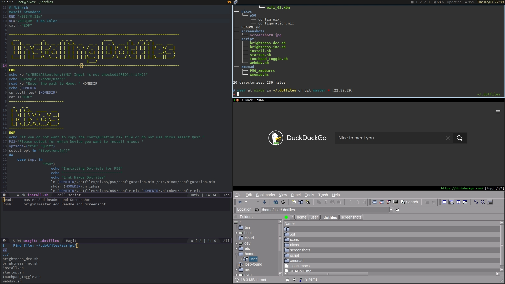

# dotfiles
**Table of Contents**

- [Introduction](#introduction)
- [bspwm](#bspwm)
	- [Screenshot](#screenshot)
	- [Programs](#programs)
	- [Keybindings](#keybindings)
- [Xmonad](#Xmonad)
	- [Screenshot](#screenshot)
	- [Programs](#programs)
	- [Keybindings](#keybindings)
	- [Install](#install)
- [License](#license)

# Introduction

This repository contains my dotfiles.  
Since 2017.04.17 I use bspwm instead Xmonad.
# bspwm
## Screenshot

## Programs
| Programm      | Category               |
| ------------- | :-------------:        |
| beancount     | ledger                 |
| bspwm         | tilling window manager |
| emacs         | text editor            |
| mirage        | image viewer           |
| nm-applet     | network manager        |
| qutebrowser   | browser vim-like       |
| redshift      | color temperature      |
| rofi          | run dialog / dmenu     |
| roxterm       | terminal emulator      |
| shutter       | screenshot tool        |
| speedcrunch   | calculator             |
| tig           | git interface          |
| tldr          | simplified man pages   |
| pcmanfm       | file manager           |
| polybar       | status bar             |

## Keybindings
| Key             | Description                                |
| ---             | ---                                        |
| d               | run dialog to start application            |
| c               | close current window                       |
| f               | switch current window to fullscreen        |
| enter           | spawn roxterm                              |
| {1..0}          | switch to workspace N                      |
| shift_{1..0}    | move current window to workspace N         |
| h,j,k,l         | vim keybindings to change current focus    |
| shift_{h,j,k,l} | vim keybindings to move the current window |
| t               | switch current window to tilling mode      |
| s               | switch current window to floating mode     |
| alt_{h,j,k,l}   | resize current window                      |
| ctrl_{h,j,k,l}  | preselect                                  |
| ctrl_space      | canel the preselection                     |
| e               | lounch pcmanfm                             |
|                 |                                            |
**Every key must be pressed in combination with the super/win key**.  
For a deeper insight, check out the config files.  
Note: You can press super/win key and move a window around in floating mode.  

# Xmonad
My Xmonad Config is heavly inspired by Shotaro Fujimoto.
Highly recommended to take a look at his Github page <https://github.com/ssh0/dotfiles>
## Screenshot

## Programs
| Programm      | Category              |
| ------------- | :-------------:       |
| beancount     | ledger                |
| emacs         | text editor           |
| mirage        | image viewer          |
| nm-applet     | network manager       |
| qutebrowser   | browser vim-like      |
| redshift      | color temperature     |
| rofi          | run dialog / dmenu    |
| roxterm       | terminal emulator     |
| shutter       | screenshot tool       |
| speedcrunch   | calculator            |
| tig           | git interface         |
| tldr          | simplified man pages  |
| trayer        | systray               |
| pcmanfm       | file manager          |
| xmobar        | status bar            |
| xmonad        | tiling window manager |
## Keybindings
| Key             | Description                                        |
| -------------   | :------------------------------------------------: |
| d               | run dialog to start application                    |
| c               | close current window                               |
| f               | switch current window to fullscreen                | 
| enter           | spawn roxterm                                      |
| 1               | switch to workspace 1                              |
| 5               | switch to workspace 2                              |
| shift_1         | move current window to workspace 1                 |
| shift_5         | move current window to workspace 5                 |
| shift_j         | change current focus forward                       |
| shift_k         | change current focus backward                      |
| shift_h         | change current workspace backward                  |
| shift_l         | change current workspace forward                   |
| x               | toogle xmobar                                      |
| .               | resize current window to the right                 |
| ,               | resize current window to the right                 |
| a               | resize current window up                           |
| z               | resize current window downward                     |
| shift_;         | switch arrangement                                 |
| -               | switch arrangement                                 |
| g               | search a window and focus into the window          |
| b               | search a window and bring to the current workspace |
| e               | spawn xfe                                          |
| p               | toogle toupad                                      |
| t               | floating window back into tilling                  |  
**Every key must be pressed in combination with the super/win key**.  
For a deeper insight, check out the config files.  
Note: You can press super/win key and move a window around in floating mode.  
## Install
**You have to look at the configuration and adjust it for your needs. If you have questions, feel free to ask.**  
The script will ask you for your home direcoty and move the dofiles there. Following it will ask you which files you want to hardlink.  
You can choose between:  
| Device         | Description              |
| ------         | -----                    |
| Lenovo P50     | My Personal Notebook.    |
| HP Probook 430 | Notebook of my girlfrind |


#### <a> 1. Clone the repository:</a>

```sh
git clone https://github.com/mscheuren/dotfiles.git
```
#### <a> 2. Run the install.sh script:</a>
If you want to install Nixos, you have to run the script as root.
```sh
.dotfiles/script/install.sh
```
Note: P50 is my lenovo notebook.
Notebook specific icons and scripts are transferred, for example, battery indicator, wifi indicator and scripts to regulate the brightness.
#### <a> 3. You may need to change the rights and owner of the home directory:</a>
```sh
chown -R user:users /home/user
```

# License
All the files in this repository (except submodule) is under 
[WTFPL - Do What the Fuck You Want to Public License]
(http://www.wtfpl.net/).

See full text at [LICENSE](./LICENSE).
